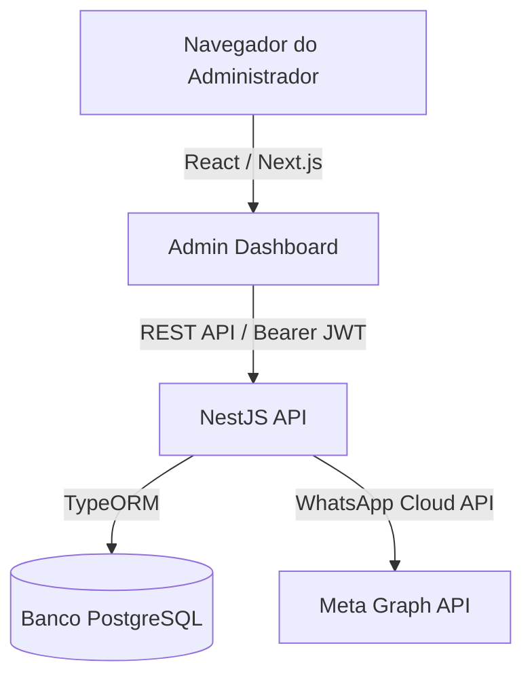

# Especificação Técnica: Arquitetura Geral do Sistema

Este documento descreve a arquitetura geral do sistema multi-tenant para gerenciamento de veículos, cobrindo o frontend administrativo (Next.js) e o backend API (NestJS).

---

## 🏗️ Visão Geral do Sistema

O sistema é composto por duas aplicações principais localizadas na raiz do projeto:

1. **`admin/`**: Frontend administrativo desenvolvido em **Next.js (App Router)**.
2. **`api/`**: Backend desenvolvido em **NestJS (Clean Architecture)**.



---

## 🎨 Frontend: `admin/` (Next.js Enterprise Architecture)

O frontend adota uma estrutura baseada em **recursos (feature-first)**, garantindo modularidade e reusabilidade de componentes.

### Arquitetura de Pastas
- `app/`: Contém as rotas do Next.js (App Router). Dividido em grupos de rotas protegidas `(admin)` e públicas `(auth)`.
- `features/`: Diretório contendo os módulos isolados de negócio:
  - `auth/`: Autenticação (Login, Registro, Hooks de Sessão).
  - `vehicles/`: Catálogo de Veículos (Listagem, Cadastro).
  - `brands/`: Marcas de Veículos extraídas e listagem de logotipos.
  - `whatsapp/`: Integração da API da Meta, templates, histórico e Chat Ao Vivo (Inbox CRM).
- `shared/`: Componentes globais comuns, layout do painel (Sidebar, Header) e hooks utilitários.
- `components/ui/`: Biblioteca local de componentes primitivos estilizados (Botões, Inputs, Selects).

### Tecnologias Principais
- **Tailwind CSS**: Estilização baseada em tokens utilitários com suporte nativo a temas (Light/Dark).
- **Lucide React**: Biblioteca padrão de ícones.
- **Context API / Custom Hooks**: Controle de estado global para sessão e concessionária (tenant) ativa.

---

## ⚙️ Backend: `api/` (NestJS Clean Architecture)

O backend segue estritamente os princípios do **DDD (Domain-Driven Design)**, **SOLID** e **Clean Architecture**, apontando as dependências de fora para dentro.

```
┌─────────────────────────────────────────────────────────────┐
│                   Camada de Apresentação                    │
│                 (Controllers, DTOs, Guards)                 │
└──────────────────────────────┬──────────────────────────────┘
                               │
                               ▼
┌─────────────────────────────────────────────────────────────┐
│                    Camada de Aplicação                      │
│                  (Serviços, Casos de Uso)                   │
└──────────────────────────────┬──────────────────────────────┘
                               │
                               ▼
┌─────────────────────────────────────────────────────────────┐
│                     Camada de Domínio                       │
│              (Entidades Puras, Interfaces)                  │
└──────────────────────────────▲──────────────────────────────┘
                               │
                               │ (Inversão de Dependência)
┌──────────────────────────────┴──────────────────────────────┐
│                  Camada de Infraestrutura                   │
│             (TypeORM, Conexões, Repositórios)               │
└─────────────────────────────────────────────────────────────┘
```

### Divisão das Camadas (por Recurso)
- **Domain Layer (`domain/`)**: Contém entidades de negócios puras (ex: `User`, `Tenant`) e contratos de repositórios (`ITenantRepository`). Sem imports de frameworks.
- **Application Layer (`application/`)**: Orquestra os fluxos através de Casos de Uso (`RegisterUserUseCase`, `LoginUserUseCase`). Enforça as regras de domínio.
- **Infrastructure Layer (`infrastructure/`)**: Contém a persistência com banco de dados (TypeORM, entidades ORM, migrações), estratégias de segurança (JWT Strategy, Passport) e serviços externos.
- **Presentation Layer (`presentation/`)**: Gerencia a entrada de requisições por meio de Controllers do NestJS, validação com `class-validator` (DTOs) e documentação via OpenAPI (Swagger).
