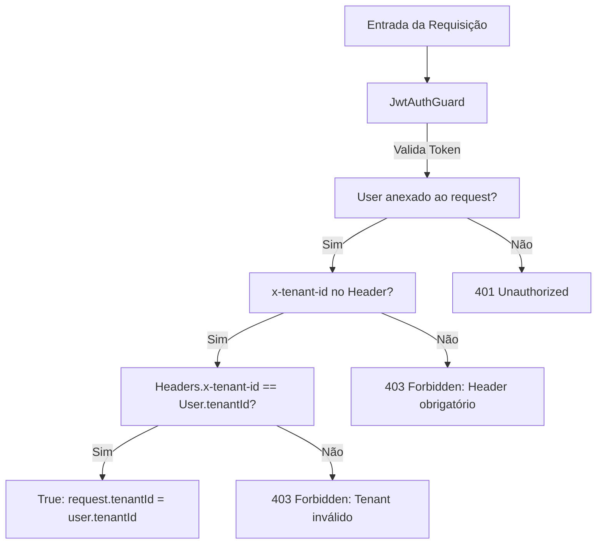

# Especificação Técnica: Autenticação e Multi-tenancy

Este documento especifica a estratégia de autenticação e o modelo de multi-tenancy (isolamento lógico de dados) adotado na plataforma.

---

## 🔒 Estratégia de Isolamento: Shared Database (Banco Compartilhado)

O sistema adota um modelo de **banco de dados único com isolamento lógico** por meio de um identificador discriminador de Tenant (`tenant_id` ou `tenantId` nas tabelas).

### Fluxo de Registro de Conta
1. O usuário submete nome, e-mail, senha e nome da concessionária no `/auth/register`.
2. A API gera um UUID único para o `Tenant` e insere o registro na tabela `tenants`.
3. A API criptografa a senha com `bcrypt` (10 rounds de hash).
4. O usuário é inserido na tabela `users` apontando para o `tenant_id` recém-criado.

### Fluxo de Login
1. O usuário submete e-mail e senha no `/auth/login`.
2. O sistema busca pelo e-mail, valida a senha com `bcrypt.compare` e monta a assinatura do JWT.
3. O JWT assinado é retornado para o cliente.

---

## 🔑 Payload do Token JWT

O token de acesso JWT carrega em sua carga útil (payload) as informações essenciais para identificar o operador e a concessionária à qual ele pertence:

```json
{
  "sub": "a2b3c4d5-e6f7-8901-2345-6789abcdef01",
  "email": "admin@capri.com.br",
  "tenantId": "f9e8d7c6-b5a4-3210-9876-543210fedcba",
  "iat": 1781822800,
  "exp": 1781909200
}
```

- **`sub`**: Identificador UUID único do usuário.
- **`tenantId`**: Identificador UUID da concessionária associada a este usuário.

---

## 🛡️ Filtro Isolador: TenantGuard

Para garantir que nenhum usuário consiga ver ou modificar dados de outra concessionária, os endpoints de negócios exigem a passagem do cabeçalho **`x-tenant-id`** e são protegidos pela combinação do `JwtAuthGuard` e `TenantGuard`.

### Diagrama de Decisão do Guard


### Exemplo de Uso nos Controllers NestJS
```typescript
@Get('vehicles')
@UseGuards(JwtAuthGuard, TenantGuard)
@ApiBearerAuth()
@ApiHeader({ name: 'x-tenant-id', required: true })
async getVehicles(@CurrentTenant() tenantId: string) {
  // O repositório irá filtrar os registros que possuam tenantId correspondente
  return this.vehicleService.findByTenant(tenantId);
}
```
