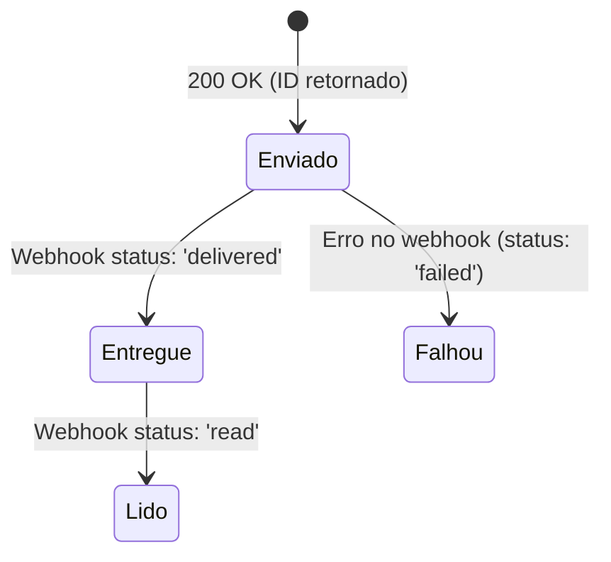

# Especificação Técnica: Integração com WhatsApp (Meta API)

Este documento especifica a arquitetura da integração com a API oficial do WhatsApp Business (Meta Cloud API) e o painel de atendimento (Live Chat/Inbox) do dashboard administrativo.

---

## ⚙️ Configurações da Meta API

A API Oficial do WhatsApp requer três parâmetros principais para autorizar e direcionar mensagens:

1. **Token de Acesso Temporário ou Permanente**: Utilizado no cabeçalho `Authorization: Bearer <TOKEN>` das requisições HTTP para a Meta Graph API.
2. **Phone Number ID (ID do Telefone)**: Identificador exclusivo do número de WhatsApp configurado no aplicativo da Meta Developers. Define a origem dos disparos.
3. **WhatsApp Business Account ID (WABA ID)**: Identificador da conta empresarial que detém a propriedade do número de telefone e dos modelos de mensagens cadastrados.

---

## 📩 Modelos de Mensagem (Templates)

Para iniciar conversas ativas (mensagens enviadas pela concessionária sem interação prévia do cliente), a Meta exige o uso de modelos aprovados.

### Sintaxe e Variáveis
Os templates são compostos por textos estáticos intercalados por variáveis dinâmicas demarcadas por chaves duplas: `{{1}}`, `{{2}}`, etc.

**Exemplo de Template de Boas-vindas (`boas_vindas_lead`)**:
> "Olá, {{1}}! Vimos seu interesse no carro {{2}} aqui na concessionária {{3}}. Como posso te ajudar hoje?"

**Valores das Variáveis correspondentes**:
- `{{1}}`: Nome do lead (ex: `Carlos`)
- `{{2}}`: Modelo do carro (ex: `Chevrolet Tracker`)
- `{{3}}`: Nome da Concessionária (ex: `Capri Premium`)

---

## 📡 Ciclo de Vida da Mensagem e Webhooks

Quando uma mensagem é disparada, ela passa por quatro estados principais que são reportados via webhook da Meta para a nossa API:

### Mock e Simulador Integrado
Na ausência de chaves de teste ativas da Meta Developers, a interface oferece um **Simulador de Envio** que replica esse ciclo de vida disparando eventos no navegador:
1. Ao clicar em "Simular Envio", o registro é salvo como `sent` (Enviado).
2. Após 2 segundos, o status atualiza no banco para `delivered` (Entregue).
3. Após mais 3 segundos, o status transiciona para `read` (Lido).

---

## 💬 Atendimento Humano (Inbox CRM / Chat Ao Vivo)

Uma vez estabelecida a comunicação pelo cliente, o painel de **Chat Ao Vivo** permite o atendimento em tempo real das mensagens recebidas e enviadas.

### Estrutura Visual do Painel de Chat
1. **Lista de Conversas (Esquerda)**: Busca e classificação de chats por filtros:
   - *Todas*: Exibe todos os chats ativos.
   - *Não lidas*: Filtra apenas por chats contendo `unreadCount > 0`.
   - *Abertas*: Filtra chats atribuídos a `Você`.
   - *Pendentes*: Filtra chats sem atendente.
2. **Visualização do Chat (Centro)**: Balões verdes para o atendente e cinza para o cliente. Controles de gerenciamento superior (**Assumir**, **Transferir** fila e **Encerrar** atendimento).
3. **Painel do Lead (Direita)**:
   - Dados detalhados da empresa, fila de atendimento (Comercial, Suporte, Financeiro) e atendente responsável.
   - **Tags Interativas**: Adição e exclusão dinâmica de tags para classificação do lead (ex: `VIP`, `Lead Quente`).
   - **Anotações Internas**: Campo de texto persistente com salvamento automático para histórico do lead.
