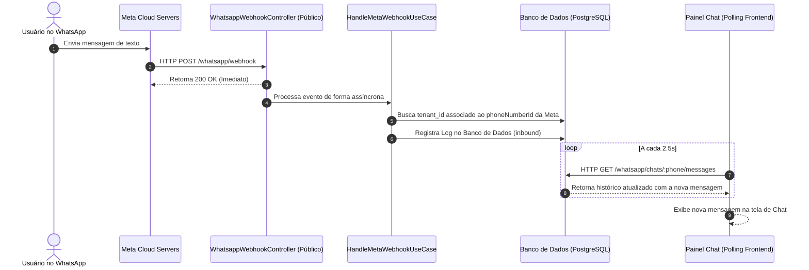

# WhatsApp Business Cloud API Integration Module

Este módulo implementa a integração oficial com a **Meta Cloud API** para o envio de mensagens (texto livre e templates), sincronização de modelos de mensagens e recebimento de webhooks em tempo real, sob uma arquitetura multi-tenant isolada.

---

## 🏗️ Arquitetura Clean / DDD

O módulo está organizado na seguinte estrutura de diretórios para garantir separação de responsabilidades (Clean Architecture):

```
src/modules/whatsapp/
├── domain/                      # Regras de Negócio e Abstrações
│   ├── entities/                # Entidades Puras (Settings, Template, Log)
│   └── repositories/            # Interfaces de Repositório (Contratos)
├── application/                 # Casos de Uso (Use Cases)
│   └── use-cases/               # Fluxos específicos (Send, Sync, Webhook)
├── infrastructure/              # Implementações de Tecnologia e Infraestrutura
│   ├── database/                # ORM Entities (TypeORM) e Repositórios Concretos
│   └── services/                # Meta Cloud API HTTP Client (MetaWhatsappService)
└── presentation/                # Controladores REST e DTOs (Exposição Externa)
    ├── controllers/             # WhatsappController (Autenticado) e Webhook (Público)
    └── dtos/                    # Validação de Entrada (class-validator)
```

---

## 💾 Modelagem de Banco de Dados (TypeORM)

Todas as tabelas são vinculadas a um `tenant_id` e possuem deleção em cascata quando o Tenant correspondente for excluído.

1. **`whatsapp_settings`**:
   - Armazena tokens e IDs de integração da Meta de cada concessionária.
   - Campos: `id`, `tenant_id`, `accessToken`, `phoneNumberId`, `businessAccountId`, `webhookVerifyToken`, `status`, `createdAt`, `updatedAt`.
2. **`whatsapp_templates`**:
   - Modelos de mensagem sincronizados.
   - Campos: `id`, `tenant_id`, `name`, `category`, `language`, `status`, `headerText`, `bodyText`, `footerText`, `buttons` (JSON), `variables` (JSON), `createdAt`, `updatedAt`.
3. **`whatsapp_logs`**:
   - Histórico de mensagens enviadas/recebidas para auditoria e Chat Ao Vivo.
   - Campos: `id`, `tenant_id`, `leadId`, `recipientName`, `recipientPhone`, `messageDirection` (`inbound` | `outbound`), `messageType`, `templateName`, `variables` (JSON), `bodyText`, `status` (`sent` | `delivered` | `read` | `failed`), `errorMessage`, `createdAt`, `updatedAt`.

---

## ⚡ Fluxo de Mensagens em Tempo Real



---

## ⚙️ Configuração do Webhook da Meta

Para receber notificações de entrega e mensagens recebidas:
1. No painel de Desenvolvedores da Meta, configure a URL de Webhook:
   - **URL de Callback**: `https://<seu-dominio-publico>/api/whatsapp/webhook`
   - **Token de Verificação**: `capri_verify_token_2026` (Ou o token correspondente à variável `META_WEBHOOK_VERIFY_TOKEN`).
2. Assine o campo **`messages`** para receber eventos de mensagens e status.

---

## 🛠️ Sandbox & Developer Experience (DX)

Se nenhuma credencial de integração ou histórico de conversas for configurado para o Tenant ativo:
- O sistema **auto-inicializará** chaves e dados de simulação locais.
- O Caso de Uso `GetWhatsappSettingsUseCase` criará configurações de fallback e inserirá um histórico de chats fictício (Mariana Costa, João Pereira) diretamente no banco de dados do Tenant para testes visuais imediatos de Chat Ao Vivo e listagem de templates.
